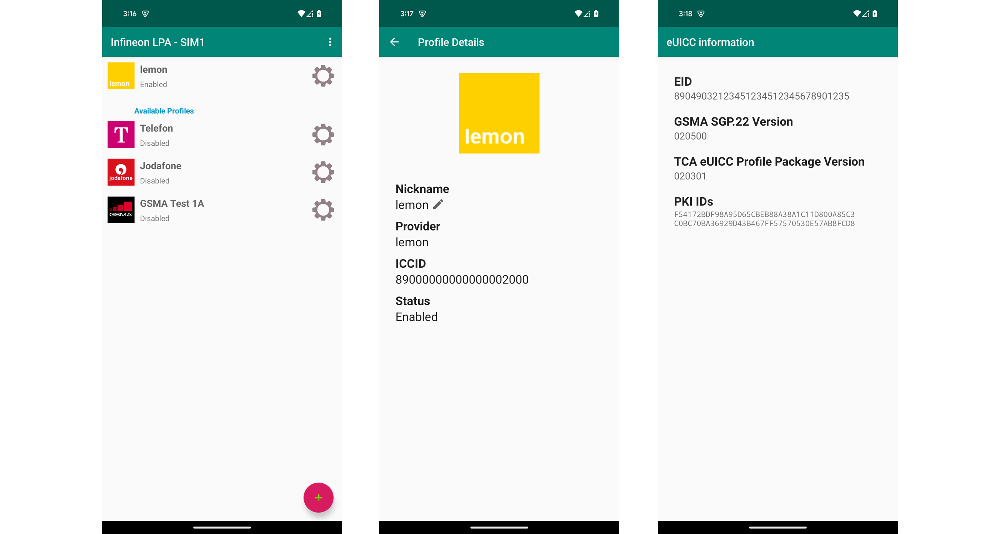

<!--
SPDX-FileCopyrightText: Copyright (c) 2024-2025 Infineon Technologies AG
SPDX-License-Identifier: MIT
-->

# Infineon Android LPA (Local Profile Assistant)

This is an example implementation of a Local Profile Assistant according to GSMA
SGP.22 for the Android platform. It shall demonstrate the user experience of an
eSIM and serve as example for OEM integration.

## Overview

This project aims to offer an example implementation of a Local Profile Assistant (LPA) as an Android application. The implementation shall show how easy it is to integrate the [Infineon OPTIGA™ Connect Consumer (OC1230)](https://www.infineon.com/cms/en/product/security-smart-card-solutions/optiga-embedded-security-solutions/optiga-connect/oc1230/) products into your Android device.

This software is developed for [Infineon OPTIGA™ Connect Consumer (OC1230)](https://www.infineon.com/cms/en/product/security-smart-card-solutions/optiga-embedded-security-solutions/optiga-connect/oc1230/) and tested with the [Infineon Test SM-DP+ profile server](https://softwaretools.infineon.com/projects/create/esim).

## Features

This software supports the following features:

* LPA according to GSMA SGP.22
  * Listing of installed profiles
  * Profile download via GSMA Live or GSMA SGP.26 SM-DP+ profile servers
    * Confirmation code handling
  * Switching/Enabling/Disabling of profiles
  * Deleting of profiles
* Support for two reader types:
  * Secure Element Reader: Reads an internal (soldered) or SIM slot inserted eSIM
  * Identiv USB Reader: Reads from an external Identiv USB reader (e.g. Identiv SCR3500)
* Display of eUICC information
  * EID of the eUICC
  * PKI IDs available in the eUICC
  * GSMA SGP.22 version supported by the eUICC
  * TCA eUICC Profile Package version supported by the eUICC

### GSMA SGP.22 version support

| version     |  support     |
|-------------|--------------|
| 2.0.0-2.5.0 | full support |
| > 3.0.0     | experimental |

NOTE: Server name extension (v3-specific FQDN) according to GSMA SGP.22 v3.1 is not supported (yet).

## Implementation information

### Development environment

* Android Studio Hedgehog 2023.1.1

### Tested devices

| **Device**          | **Software**                                                   | **Interface**                                                                                                                      | **Remark**                                                                                        |
|---------------------|----------------------------------------------------------------|------------------------------------------------------------------------------------------------------------------------------------|---------------------------------------------------------------------------------------------------|
| Google Pixel 6 Pro  | AOSP 14 prebuild (raven userdebug 11293981)                    | OMAPI (default, tested) and Telephony Manager (tested, can be enabled via settings menu)                                           | Fully functional                                                                                  |
| Googel Pixel 8      | AOSP 14 prebuild (shiba userdebug 11911195)                    | OMAPI (default, tested) and Telephony Manager (tested, can be enabled via settings menu)                                           | Fully functional                                                                                  |
| Googel Pixel 8 Pro  | AOSP 14 prebuild (husky userdebug 12670746)                    | OMAPI (default, tested) and Telephony Manager (tested, can be enabled via settings menu)                                           | Fully functional                                                                                  |
| Redmi Note 12       | Android 13 (TKQ1.221114.001) (rooted with Magisk)              | OMAPI (default, tested, timeout at enable profile but successful) and Telephony Manager (tested, can be enabled via settings menu) | Partially functional (only works with SGP26 configuration)                                        |
| Samsung Galaxy Note | Android 13 (TP1A.220624.014.X205XXS2CWC3) (rooted with Magisk) | OMAPI (default, tested - unstable communication) only                                                                              | Partially functional (only works with SGP26 configuration and Enable/Disable Profile (unstable!)) |

### Project structure

* com.infineon.esim.lpa
  * Android implementation with LPA user interface
* com.infineon.esim.lpa.core
  * Core LPA logic
* com.gsma.sgp.messages
  * Java classes of GSMA SGP.22 messages (ASN1 schema)
* com.infineon.esim.util
  * Utility classes

### Software dependencies

The Infineon Android LPA is based on the following dependencies:

* Android CCID Library v1.2 for Identiv USB smartcard readers
  * This library serves as an interface between Android platform with USB host support and
    Identiv CCID compliant USB smartcard readers. Android application developers will
    integrate this library as part of their Android application to communicate with Identiv’s
    CCID readers.
  * Automatically downloaded via Gradle task before build
* Other dependencies see in app/build.gradle

### Documentation

Please see the [User Guide](docs/userguide/userguide.md) for more documentation.

## Additional information

### Related resources

* [OPTIGA™ Connect Consumer - product page](https://www.infineon.com/OPTIGA-Connect-Consumer)
* [OPTIGA™ Connect Consumer - GitHub overview](https://github.com/Infineon/optiga-connect-consumer-lpa-android)

## Licensing

Please see our [LICENSE](LICENSE) for copyright and license information.

This project follows the [REUSE](https://reuse.software/) approach, so copyright and licensing
information is available for every file (including third party components) either in the file
header, an individual *.license file or the [REUSE.toml](REUSE.toml) file. All licenses can be
found in the [LICENSES](LICENSES) folder.
