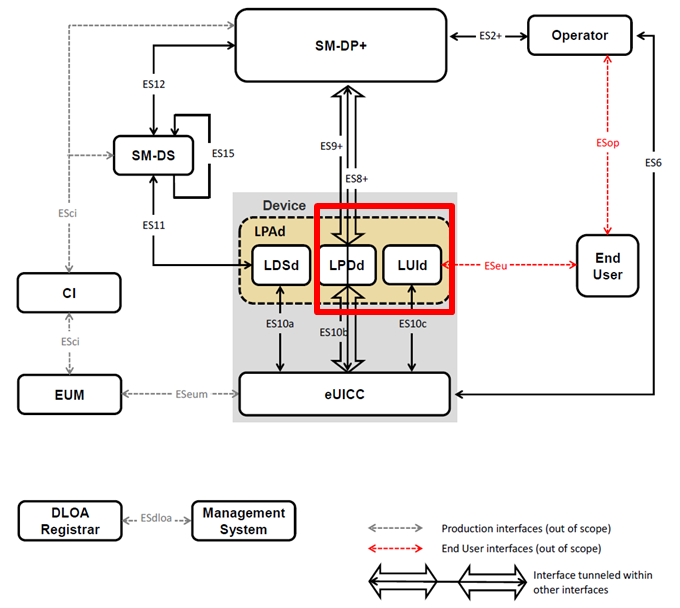
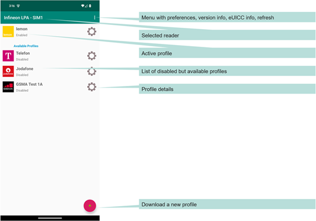
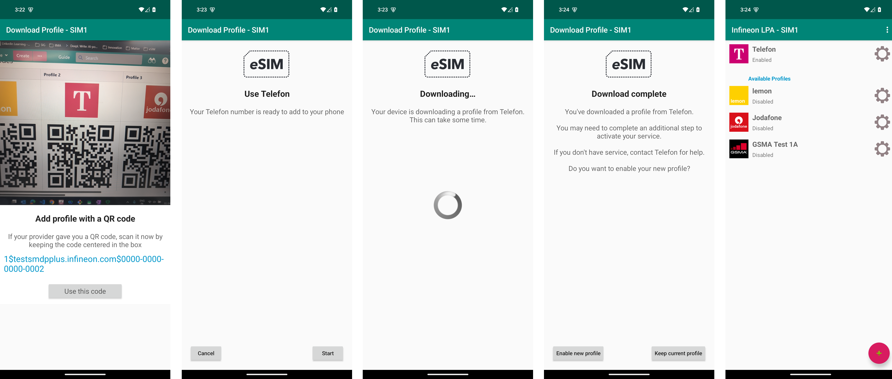
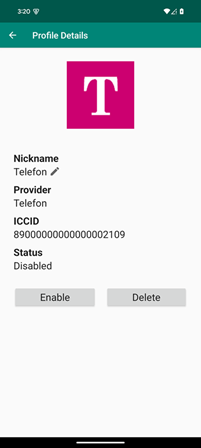
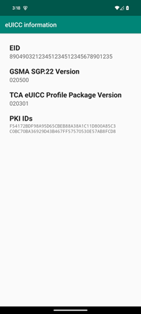
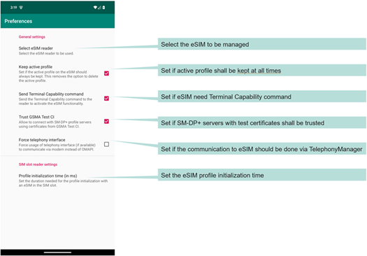
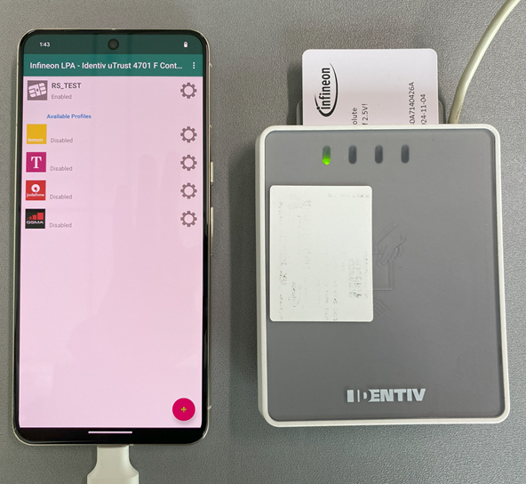

# Infineon Android LPA

## A Local Profile Assistant Example Implementation

> **Application Note** \
> **OPTIGA™ Connect Consumer OC1230**

## About this document

### Scope and purpose

This document shall enable software and solution developers to
understand and use the source code provided within the “Infineon Android
LPA” project.

### Intended audience

Software developers, solution developers and integrators who want to use
or integrate the OPTIGA™ Connect Consumer products from Infineon.

## Introduction

This project aims to offer an example implementation of a Local Profile
Assistant (LPA) as an Android application. The implementation shall show
how easy it is to integrate the Infineon OPTIGA™ Connect Consumer
products into your Android device.

With the Infineon Android LPA you will be able to

- List the installed profiles on the eSIM/eUICC
- Enable/Disable/Switch profiles
- Show profile details
- Delete profiles
- Download new profiles via QR code from Live or Test SM-DP+ profile servers
- Show eSIM/eUICC details

using an OPTIGA™ Connect Consumer OC1230 engineering sample

- in the SIM slot of the phone
- in an Identivate USB Reader connected to the phone via OTG adapter

### Scope of the Project

The GSMA SGP.22 \[1\] distinguishes between two variants of LPAs. The
LPAe inside the eUICC itself and the LPAd in the device (host). This
project gives an implementation for an LPAd that is hosted on an Android
device.

The LPAd is further divided in three sub modules:

- Local Profile Download (LPDd)
- Local User Interface (LUId)
- Local Discovery Service (LDSd)

The scope of this project is restricted to the LPDd and LUId, since the
LDSd is not necessary for downloading a new profile via a normal QR
code.

This implementation therefore supports the following interfaces
specified in \[1\]:

- ES9+: Interface between LPAd (LPDd) and SM-DP+ server
- ES10b, ES10c: Interface between LPAd (LPDd) and eUICC
- ES8+: implicitly supported
- ESeu: User interface between LPAd (LUId) and End User

The scope of the project is also shown with the red rectangle in Figure 1.



Figure: Scope of the project marked with red rectangle.

## Getting Started

To get started with the software project, you’ll need:

- Hardware:
  - OPTIGA™ Connect Consumer OC1230 engineering sample
  - Android phone with Android 8 or higher (e.g. Google Pixel 8 Pro)
  - Optionally: Identiv USB reader (e.g. SCR3500) and OTG adapter
- Software:
  - Infineon Android LPA source code
  - Android Studio (see next steps)

Please perform the following steps to start and build the software project.

1. Download and install Android Studio
    - Download Android Studio from: <https://developer.android.com/studio>
    - Install Android Studio
    - Open Android Studio
2. Clone the Infineon Android LPA repository from GitHub
    - Navigate to the project's GitHub repository.
    - Clone the repository using the following command

   ```text
      git clone https://github.com/Infineon/optiga-connect-consumer-lpa-android.git
    ```

    - Open Android Studio, go to File -> Open, and select the cloned project folder.
    - Wait until Project and Gradle synchronization is finished
3. Build the project
    - Build -&gt; Make project

Now the Infineon Android LPA can be easily installed to your target
device via Android Studio.

### Install as system app

For full functionality, the app must run as system app to access obtain the required privileges for MEP support. To do so, perform the following steps:

1. Open a terminal in the repo's root folder
2. Run the following commands:

   ```text
    adb root
    adb remount
    adb push .\app\build\outputs\apk\debug\app-debug.apk /system/priv-app/ 
    adb shell chmod 755 /system/priv-app/app-debug.apk
    adb push .\privapp_whitelist_com.infineon.esim.lpa.xml /system/etc/permissions/
    adb reboot
    ```

3. Once the smartphone has rebooted, the app is installed as system app. Future installations (i.e., when changing the source code) and debugging are now possible normally using Android Studio.

## Using the Infineon Android LPA Application

### Displaying installed profiles

The main screen of the application shows a profile list with the active
(enabled) and available (installed but disabled) profiles. Please see
the following screenshot.



Figure: Profile list screen.

The following interactions are possible from the profile list:

1. Open the menu on the top right
    1. Go to app preferences
    2. Show eUICC info
    3. Show app version info
    4. Show open source licenses
    5. Refresh profile list
2. Show details of a profile by pressing the gear symbol next to the profile
3. Enable a profile by pressing the icon or the name of a profile.
4. Download a new profile by pressing the + on the bottom right.

### Downloading a new profile

To download a new profile, there are two options that can be selected, once the '+' button is pressed:

1) Using a QR code with activation code
2) Enter activation code manually


Figure: Screenshots of the profile download options.



Figure: Screenshots of the profile download process using QR code scanner.

### Profile Details

The following screenshot shows the profile details screen. Here you can
see the profile nickname, the provide name, the ICCID and the enablement
status. With the button enable/disable, you can enable/disable the
profile. With the button delete, you can delete the profile. The latter
option might only be available if the profile is already disabled (see
the preference menu for details).

The nickname of the profile can be modified with a click on the pencil
icon and is directly stored to the eUICC.



Figure: Profile details screen.

### eUICC Details

The following screenshot shows the eUICC details screen.



Figure: eUICC details screen.

### Preferences

The following screenshot shows the preference screen that can be reached
via the main screen by pressing the ellipsis symbol on the top right an
selecting “preferences” from the menu.



Figure: Preferences screen.

### Using an external Identiv USB Reader

To use an external Identiv USB reader an OTG adapter has to be used. See
Table 1 for a list of the supported Identiv USB readers.

Table: List of supported Identiv USB readers.

| Reader name                                  |
|----------------------------------------------|
| SCR3500 A Contact Reader                     |
| CLOUD 4700 F Dual Interface Reader           |
| uTrust 4701 F Dual Interface Reader          |

See the following image for a possible setup of a smartphone with
attached USB reader.



Figure: Infineon Android LPA on Google Pixel 4 XL with attached Identiv SCR 3500 and OPTIGA™ Connect Consumer OC1230 sample in ID1 package..

## Software project description

### Development environment

The following setup has been used to create the software project:

Development environment description

| Type                        | Description                              |
|-----------------------------|------------------------------------------|
| IDE                         | Android Studio Hedgehog 2023.1.1 Patch 1 |
| Build Tool                  | Gradle Build Tool 8.2                    |
| Minimum Android SDK Version | 28 (Android 8)                           |
| Target Android SDK Version  | 34 (Android 14)                          |
| Source Compatibility        | Java 8                                   |

*NOTE: The [Android Secure Element OMAPI](https://developer.android.com/reference/android/se/omapi/package-summary) that enables the use of an eSIM was added in Android SDK 28 (Android 8) and is a substantial requirement for this project. This is why the minimum Android SDK version is 28.*

### Core, messages and util module dependencies

The main software dependencies are listed in the following tables.

Dependencies for module core

| Library name              | Version | Remark                          |
|---------------------------|---------|---------------------------------|
| messages                  | -       | Messages module for ASN1 schema |
| util                      | -       | Util module                     |
| com.beanit:jasn1          | 1.11.3  | ASN1 codec                      |
| com.google.code.gson:gson | 2.10    | JSON codec                      |

Dependencies for module messages

| Library name              | Version | Remark                          |
|---------------------------|---------|---------------------------------|
| util                      | -       | Util module                     |
| com.beanit:jasn1          | 1.11.3  | ASN1 codec                      |

Please see all further dependencies from the build.gradle files in the project.

### App module dependencies

#### Identiv USB reader library

As a fallback to using an eSIM inside the SIM slot of the phone, we
introduced the support of external USB readers from Identiv (e.g.
Identiv SCR3500A). This introduces a dependency on the Identiv Android
Reader Library below.

Identive USB Reader Library Details

| Library name                   | Version | Remark                                                                   |
|--------------------------------|---------|--------------------------------------------------------------------------|
| com.identive.libs:androidSCard | 1.2     | Support for Identiv USB readers as fallback for use of internal eSIM/SE. |

This library is automatically downloaded during the build process via a
Gradle script in app/build.gradle.

If you want to download the library manually, follow these steps:

1. Download Identiv Android CCID Library from [https://support.identiv.com/developer-tools-for-smart-card-readers/](https://support.identiv.com/developer-tools-for-smart-card-readers/)
2. Unzip the zip file
3. Copy the androidSCardV1.2.jar file to folder /app/libs/

#### Further Dependencies

Please review the build.gradle files in the project.

### Project Structure

The project follows the generic code structured of an Android
application.

```text
001 lpa.android
002 ├── app
003 │   ├── libs
004 │   └── src
005 │       └── main
006 │           ├── java
007 │           │   └── com.infineon.esim.lpa
008 │           └── res
009 ├── core
010 │   └── src
011 │       └── main
012 │           └── java
013 │               └── com.infineon.esim.lpa.core
014 ├── messages
015 │   └── src
016 │       └── main
017 │           └── java
018 │               ├── com.gsma.sgp.messages
019 │               └── com.infineon.esim.messages
020 ├── util
021 │   └── src
022 │       └── main
023 │           └── java
024 │               └── com.infineon.esim.util
025 └── doc
```

The main parts of the code are described in the following table.

General Code Structure Description

| Package Name               | Description                                                            |
|----------------------------|------------------------------------------------------------------------|
| **app/libs**               | Third party libs that are not available via Gradle                     |
| **app/src/main/java**      | Java source code of the Android application                            |
| **app/src/main/res**       | Resources of the Android application, e.g. layouts, values, icons etc. |
| **core/src/main/java**     | Basic LPAd core functionality                                          |
| **messages/src/main/java** | GSMA SGP.22 ASN1 schema as Java classes                                |
| **util/src/main/java**     | Utility classes                                                        |
| **doc**                    | Documentation, including Application Note                              |

#### Package com.infineon.esim.lpa

The com.infineon.esim.lpa package comprises the source code of the
Android application and integrates the basic LPAd functionality of the
com.infineon.esim.lpa.core LPAd library.

The general code structure of the com.infineon.esim.lpa package looks as
follows.

```text
001 com.infineon.esim.lpa
002 ├── data
003 ├── euicc
004 │   ├── base
005 │   ├── identive
006 │   └── se
007 ├── lpa
008 ├── ui
009 │   ├── dialog
010 │   ├── downloadProfile
011 │   ├── enterActivationCode
012 │   ├── euiccDetails
013 │   ├── generic
014 │   ├── preference
015 │   ├── profileDetails
016 │   ├── profileList
017 │   └── scanBarcode
018 └── util
019     ├── android
020     └── threading
```

In the following table the sub-packages are further explained with their
functionality.

Package com.infineon.esim.lpa description

| Package Name               | Description                                                     |
|----------------------------|-----------------------------------------------------------------|
| **euicc**                  | eUICC implementations for Secure Element and Identiv USB reader |
| **data**                   | Data model of the Android application                           |
| **lpa**                    | LPA background tasks needed for APDU communication etc.         |
| **ui**                     | User Interface implementation of the Android application        |
| **ui.dialog**              | Custom confirmation dialog                                      |
| **ui.downloadProfile**     | Activity for the profile download                               |
| **ui.enterActivationCode** | Activity to enter an activation code for the profile download   |
| **ui.euiccDetails**        | Activity for eUICC details presentation                         |
| **ui.generic**             | Generic objects used to UI management                           |
| **ui.preference**          | Activity for preferences                                        |
| **ui.profileDetails**      | Activity for profile details presentation                       |
| **ui.profileList**         | Main activity for display of the profile list                   |
| **ui.scanBarcode**         | Activity to scan a QR code for the profile download             |
| **util**                   | Utility classes                                                 |
| **util.android**           | Utility classes for Android-specific topics                     |
| **util.threading**         | Utility classes for multi-threading                             |

#### Package com.infineon.esim.lpa.core

The com.infineon.esim.lpa.core contains the source code for the LPAd
functionality.It supports the following additional features:

- All GSMA SGP.22 specified ES9+ functions
  - InitiateAuthentication
  - AuthenticateClient
  - GetBoundProfilePackage
  - HandleNotification
  - CancelSession
- All GSMA SGP.22 specified ES10 functions
- Confirmation code handling
- Support for BF76 tag

The general code structure of the com.infineon.esim.lpa.core package
looks as follows.

```text
001 com.infineon.esim.lpa.core
002 ├── dtos
003 ├── es9plus
004 ├── es10
005 └── worker

```

In the following table the sub-packages are further explained with their
functionality.

Package com.infineon.esim.lpa description

| Package Name               | Description                                                            |
|----------------------------|------------------------------------------------------------------------|
| **es9plus**                | ES9+ interface according to [1]                                        |
| **es10**                   | ES10 interface according to [1]                                        |
| **dtos**                   | Data transfer objects for LPA management and module API                |
| **worker**                 | Workers that perform LPA functionality                                 |

## Issues and Limitations

### Out of Scope

Currently out of scope of the project are the following topics:

- Using an SM-DS Discovery Service for profile download.
- Support for modem functionality that goes beyond the OMAPI functionality. E.g.
  AT commands.

## Glossary of Acronyms

### Acronyms

| Acronym | Description                                                                                                           |
|---------|-----------------------------------------------------------------------------------------------------------------------|
| APDU    | Application Protocol Data Unit                                                                                        |
| API     | Application Programming Interface                                                                                     |
| ASN.1   | Abstract Syntax Notation One                                                                                          |
| AT      | Stands for ATtention command wich ist used to control modems                                                          |
| BLE     | Bluetooth Low Energy                                                                                                  |
| BPP     | Bound Profile Package                                                                                                 |
| BSD     | Berkeley Source Distribution                                                                                          |
| cURL    | Client URL is a tool for transferring data using various network protocols.                                           |
| ECDSA   | Elliptic Curve Digital Signature Algorithm                                                                            |
| eSIM    | Embedded Subscriber Identity Module                                                                                   |
| ES2+    | Interface used by the Operator to order profiles and perform other administrative functions.                          |
| ES9+    | Interface to provide a secure transport between the SM-DP+ and the LPA for the delivery of the Bound Profile Package. |
| ES10    | Interface between the LPA and the eSIM for profile management and transfer of a Bound Profile Package.                |
| eUICC   | Embedded Universal Integrated Circuit Card                                                                            |
| GP      | GlobalPlatform                                                                                                        |
| GSM     | Global System for Mobiles                                                                                             |
| GSMA    | GSM Association                                                                                                       |
| ID-1    | A standard card size of 85.60 by 53.98 mm.                                                                            |
| IoT     | Internet of Things                                                                                                    |
| JSON    | JavaScript Object Notation                                                                                            |
| LPA     | Local Profile Assistant                                                                                               |
| LTE     | Long Term Evolution                                                                                                   |
| MIT     | Massachusetts Institute of Technology                                                                                 |
| MIT/X   | MIT License for the X Window System                                                                                   |
| OS      | Operating System                                                                                                      |
| PCSC    | Personal Computer / Smart Card                                                                                        |
| PPP     | Point to Point Protocol                                                                                               |
| RSP     | Remote SIM Provisioning                                                                                               |
| SIM     | Subscriber Identity Module                                                                                            |
| SM-DP+  | Subscription Manager – Data Preparation. A profile server for MNO profiles over interface ES9+.                       |
| UART    | Universal Asynchronous Receiver-Transmitter                                                                           |
| UI      | User Interface                                                                                                        |
| UICC    | Universal Integrated Circuit Card                                                                                     |
| USB     | Universal Serial Bus                                                                                                  |

### References

[1]  GSM Association SGP.22 RSP Technical Specification, Version 2.4.0\
[2]  [Android Developers: android.se.omapi OMPI documentation](https://developer.android.com/reference/android/se/omapi/package-summary)

### Revision history

| Document version  | Date of release  | Description of changes                                             |
|-------------------|------------------|--------------------------------------------------------------------|
| 1.0.0             | 15 January 2021  | Initial version.                                                   |
| 2.0.0             | 05 August 2021   | Update for release of version 2.0.0 of the application.            |
| 2.0.2             | 08 October 2021  | Minor fixes and alignment with software version number.            |
| 3.0.0             | 07 February 2022 | Major modularization and reduction of dependencies of the project. |
| 4.0.0             | 24 June 2022     | Release for distribution.                                          |
| 4.0.1             | 10 August 2022   | Added support for two new Identiv readers (see Table 1).           |
| 4.0.2             | 23 August 2022   | Bugfix release.                                                    |
| 4.0.3             | 19 April 2023    | Maintenance release.                                               |
| 4.1.0             | 13 March 2024    | Update to basic GSMA SGP.22 v3 support and maintenance             |
